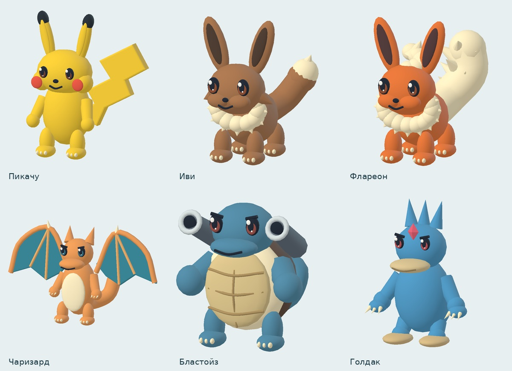

# Pokeblox 0.5.0 — модели и эволюция



Изображение выше — рендер фактической геометрии моделей отдельным программным рендерером; освещение в игре отличается.

31 оригинальная объёмная модель с плавными силуэтами, глазами, деталями шерсти, панцирей, крыльев и плавников. Геометрия кэшируется и объединена в один draw call на покемона.

Эволюция: отдельная 3D-сцена, цвет используемого камня, подъём, свечение, смена силуэта и раскрытие новой формы. Кнопка продолжения доступна после фактического завершения анимации; учтён prefers-reduced-motion. Камень и новая форма сохраняются один раз до сцены. Формат сохранений и аккаунты не меняются.

# Покеблокс · Канто и Приливный остров

Браузерная 3D-игра на русском языке: два острова, 31 форма покемонов, исследование, пошаговые бои, ловля и эволюции. Версия 0.5.0.

Обновление по фотографии: оригинальные объёмные модели с отдельной геометрией видов, Приливный остров с 19 указанными покемонами и боссом Голдаком 45 уровня, смена бойца, 3D-анимация эволюции, горизонтальное мобильное управление и установка PWA. Переправа доступна в карте после 3 побед в Канто. Победа над боссом даёт значок, 5 конфет и 20 покеболов один раз. Голдака в команду можно получить эволюцией Псайдака. Мэджикарп не эволюционирует. Гравелер → Голем на 36 уровне — адаптация обмена для одиночной игры.

Установка: кнопка «Установить игру» на стартовом экране; на iPhone — Safari → Поделиться → На экран Домой. Это веб-приложение, не APK; для входа и серверных сохранений нужен интернет. Ориентация задаётся манифестом, на телефонах в портретном режиме показана подсказка поворота.

Сохранения v2 автоматически читаются как v3 с прежней командой и инвентарём. Состояния обоих островов сохраняются отдельно. Старый клиент не может перезаписать уже обновлённое сохранение. База и аккаунты не пересоздаются.

## Игровые возможности

- Первый напарник — Пикачу. Остальных покемонов нужно найти на острове.
- Иви встречается с вероятностью 5% при появлении покемона на поляне, в лесу и грозовой роще. Чаризард — 0,5% в янтарных скалах. Это баланс этой игры; единой редкости для всех игр Pokémon нет.
- Все 10 путей эволюции из исходной таблицы: уровни 16/36, 16/32, 16/36; громовой камень для Пикачу; три камня для Иви.
- Карта, покедекс, характеристики, рюкзак, лечение в лагере, четыре задания первой части. Три задания Приливного острова и его арена.
- Клавиатура: WASD/стрелки, E — взаимодействие, Q — команда, P — покедекс, B — рюкзак, M — карта, Shift — бег, пробел — прыжок. На телефоне — экранный джойстик.

## Аккаунты и сохранения

Любой посетитель может зарегистрироваться с логином и паролем. Почта не требуется. Команда, уровни, опыт, здоровье, инвентарь, задания, открытые формы, место и камера на карте, перезарядка предметов, дикие покемоны, звук и текущий бой сохраняются отдельно для каждого аккаунта.

Сохранение отправляется после игровых действий, каждые 5 секунд и при уходе со страницы. Надпись «Сохранено» означает подтверждение сервера. При обрыве связи браузер хранит очередь неотправленных изменений в IndexedDB и повторяет отправку. На другом устройстве доступен последний подтверждённый сервером прогресс. Очистка данных браузера удалит неотправленный черновик.

Две одновременно открытые игры не перезаписывают друг друга молча: при конфликте нужно загрузить последнее серверное сохранение. Результат хода фиксируется перед анимацией, поэтому перезагрузка во время поимки не выдаёт покемона повторно.

Пароли хранятся как scrypt-хеши с индивидуальной солью. Сессии — HttpOnly/SameSite cookie, в production также Secure. Есть проверка CSRF и ограничение попыток входа. Сессия действует 30 дней; после повторного входа прогресс остаётся. Восстановление забытого пароля по почте пока не реализовано.

## Локальный запуск

Нужен Node.js 24. Пакетов npm для работы сервера не требуется.

```sh
npm test
npm start
```

Игра откроется на http://localhost:3000. По умолчанию база находится в `data/pokeblox.db`.

## GitHub → Amvera

1. Создать отдельный репозиторий `pokeblox-kanto` и загрузить **содержимое** этого проекта в его корень. `amvera.yaml` и `Dockerfile` должны лежать рядом. Базу данных и файлы `.env` не загружать.
2. В Amvera создать отдельное приложение, выбрать сборку Docker и загрузить код из репозитория. Существующее приложение «Котость» для этого не используется.
3. В конфигурации уже заданы порт `3000` и постоянная папка `/data`. Переменная `DB_PATH=/data/pokeblox.db` задана в Dockerfile. Оставить **одну реплику**: эта версия использует локальный SQLite.
4. Подключить предоставленный Amvera HTTPS-домен. После получения домена рекомендуется задать `PUBLIC_URL` равным его адресу, без пути. HTTP в production не поддерживает защищённую cookie входа.
5. Запустить сборку и приложение. Проверить `/healthz`, затем регистрацию, вход, сохранение и продолжение после перезагрузки страницы. Обновление GitHub само по себе не гарантирует запуск сборки — проверить настроенную интеграцию или отправить изменения в Git Amvera.

Если используется Git Amvera, адрес remote нужно скопировать из конкретного проекта:

```sh
git remote add amvera <адрес-из-Amvera>
git push amvera main:master
```

`/data` должна оставаться постоянным хранилищем при пересборке и перезапуске. Приложение проверяет создание резервной копии каждый час, делает одну копию в день и хранит семь последних в `/data/backups`. Это копии на том же диске; удаление хранилища Amvera удалит и их. Для независимого резервирования скачивать копии отдельно. Для восстановления остановить приложение и заменить базу согласованной копией; не копировать только основной SQLite-файл работающей базы без WAL.

## Проверки и ограничения

`npm test` проверяет эволюции, игровые ограничения, локальные модели, регистрацию, изоляцию аккаунтов, CSRF, конфликт двух вкладок, повторную отправку и восстановление сохранения после реального перезапуска сервера.

Браузерная проверка новой версии и проверка на физическом телефоне пока не выполнены. Публикация выполняется через GitHub → Amvera.

Это одиночная игра с личными сохранениями, без совместного мира и таблицы рекордов. Сервер проверяет формат прогресса; полного серверного античита нет.

## Источники

- Базовые характеристики и коэффициенты ловли: https://github.com/PokeAPI/pokeapi/tree/master/data/v2/csv. Точные источники и дата — `public/assets/pokemon-stats-sources.json`.
- Архив моделей предыдущей версии: https://github.com/Pokemon-3D-api/assets. URL и контрольные суммы — `public/assets/sources.json`.
- Three.js 0.170.0 и Draco находятся в `public/vendor/`, вместе с лицензиями. CDN во время игры не используется.
- Конфигурация Amvera: https://docs.amvera.ru/applications/configuration/docker.html и https://docs.amvera.ru/applications/storage.html.

Права на Pokémon и модели принадлежат Nintendo / Creatures Inc. / GAME FREAK inc. Это неофициальный фанатский проект. MIT-лицензия репозитория моделей не заменяет разрешение правообладателей на персонажей.

Текущие модели создаются локально в `public/quest-models.mjs`, без загрузки GLB. Численные данные новых видов проверены по PokeAPI CSV 2026-09-28. `tests/island2.mjs` проверяет модели, миграцию, острова, бой и босса. В облачном проверочном браузере WebGL может быть отключён; это ограничивает проверку настоящего 3D-рендеринга.
